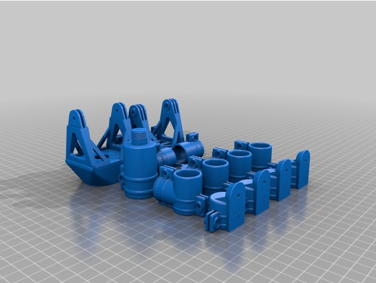
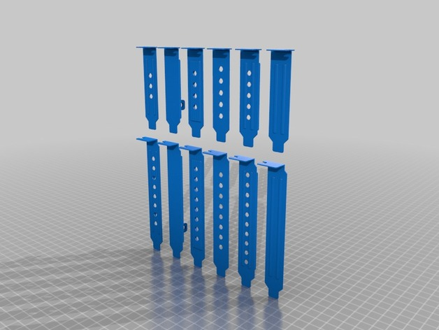
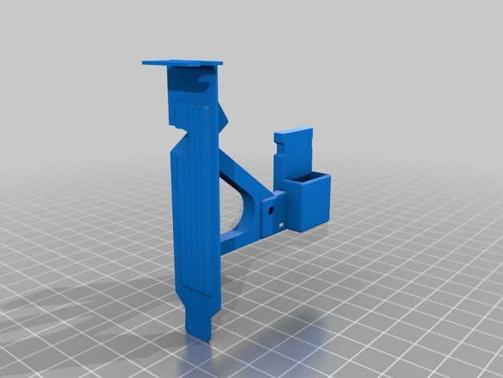
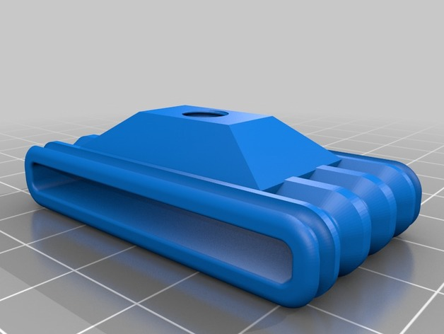

> A documented mechanical design library for [OpenSCAD].

NOTICE
------

<i>The library has been updated to work with the latest release version
of OpenSCAD {{ site.vopenscad }}. It also is working with the latest
development snapshots, as of this writing. Please note that there has
been major changes in the API names from the prior version.</i>

Introduction
------------

[omdl] is an [OpenSCAD] mechanical design library that provides
open-source high-level design primitives with coherent documentation
generated by [Doxygen] using [openscad-amu].

With Doxygen, the code documentation is written within the code itself,
and is thus easy to keep current. Moreover, it provides a standard way
to both write and present OpenSCAD design documentation, compilable to
common output formats (html, pdf, etc). With [omdl], all library
primitives are \em parametric with minimal, mostly zero, global
variable dependencies and all library API's include [markups] that
describe its parameters, behavior, and use.

[Validation] scripts are used to verify that the core operations work
as expected across evolving [OpenSCAD] versions. This validation is
performed when building and [installing] the library documentation).
The library uses a common set of conventions for specifying [data
types] and is divided into individual component modules of
functionality, organized into groups, that may be included as desired.

To get started using [omdl], please see the GitHub source [repository].

Design Examples
---------------

<table>
<colgroup>
<col width="25%" />
<col width="75%" />
</colgroup>
<thead>
<tr class="header">
<th>example</th>
<th>description</th>
</tr>
</thead>
<tbody>

<tr>
<td>

</td>
<td>
<a href="http://www.thingiverse.com/thing:2051608">
A Portable solar panel tripod mount
</a>: Designed in 48 hours from concept to assembly using omdl and openscad-amu.
</td>
</tr>

<tr>
<td>

</td>
<td>
<a href="http://www.thingiverse.com/thing:2836187">
PCI Bracket Generator
</a>
</td>
</tr>

<tr>
<td>

</td>
<td>
<a href="http://www.thingiverse.com/thing:2841089">
PCI-E 1x Riser Card Bracket
</a>
</td>
</tr>

<tr>
<td>

</td>
<td>
<a href="http://www.thingiverse.com/thing:2811619">
Webcam tripod mount
</a>
</td>
</tr>

</tbody>
</table>

[omdl]: https://royasutton.github.io/omdl
[repository]: https://github.com/royasutton/omdl

[openscad-amu]: https://royasutton.github.io/openscad-amu
[Doxygen]: http://www.doxygen.nl
[OpenSCAD]: http://www.openscad.org

