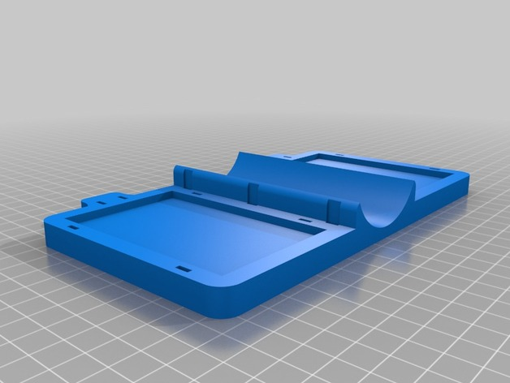
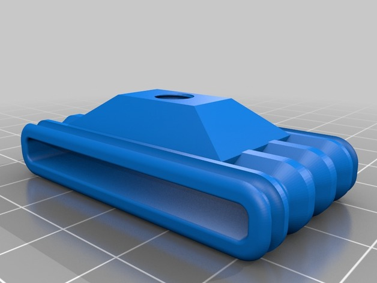
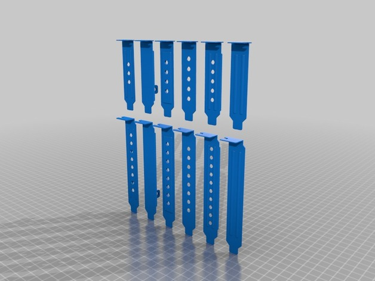
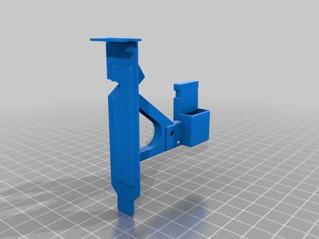

> An open mechanical design library for [OpenSCAD].

Introduction
------------

[omdl] is an [OpenSCAD] mechanical design library that provides
open-source high-level design primitives with documentation generated
by [Doxygen] using [openscad-amu].

Its' primitives are [validated], it uses common conventions for
specifying [data types], and is divided into component [modules],
organized in groups, that may be included individually as desired.

### Grouped Modules ###

<table>
  
    
  
  
    <a href="{{ site.api_vcurrent }}/group__{{ group }}.html">
      {{ group }}
    </a>
  
</table>

Getting Started
---------------

### Setup ###

See the GitHub source [repository] for [setup instructions].

### Library API ###

* [Current release] {{ site.vcurrent }} --- (API subject to change).
* [Other releases]

Design Examples
---------------

* 
  [A Portable solar panel tripod mount](http://www.thingiverse.com/thing:2051608):
  Design took approximately 48 hours from concept to assembly and
  documentation using [omdl] and [openscad-amu].
* 
  [Quad HP-USB video adapter monitor post mount](https://www.thingiverse.com/thing:2807314).
* 
  [Webcam tripod mount](https://www.thingiverse.com/thing:2811619).
* 
  [PCI Bracket Generator](https://www.thingiverse.com/thing:2836187).
* 
  [PCI-E 1x Riser Card Bracket](https://www.thingiverse.com/thing:2841089).

Contributing
------------

[omdl] uses [git] for development tracking, and is hosted on [GitHub]
following the usual practice of [forking] and submitting [pull requests]
to the source [repository].

As it is released under the [GNU Lesser General Public License], any
file you change should bear your copyright notice alongside the
original authors' copyright notices typically located at the top of
each file.

Ideas, requests, comments, contributions, and constructive criticism
are welcome.

Contact and Support
-------------------

In case you have any questions or would like to make feature requests,
you can contact the maintainer of the project or file an [issue].

[validated]: {{ site.api_vcurrent }}/validation.html
[data types]: {{ site.api_vcurrent }}/dt.html
[modules]: {{ site.api_vcurrent }}/modules.html
[current release]: {{ site.api_vcurrent }}/index.html
[Other releases]: {{ site.api }}/index.html

[GNU Lesser General Public License]: https://www.gnu.org/licenses/lgpl.html

[omdl]: https://royasutton.github.io/omdl
[repository]: https://github.com/royasutton/omdl
[issue]: https://github.com/royasutton/omdl/issues

[setup instructions]: https://github.com/royasutton/omdl#setup

[openscad-amu]: https://royasutton.github.io/openscad-amu

[Doxygen]: http://www.doxygen.nl
[Doxygen markups]: http://www.doxygen.nl/manual/commands.html

[OpenSCAD]: http://www.openscad.org

[git]: http://git-scm.com
[GitHub]: http://github.com
[forking]: http://help.github.com/forking
[pull requests]: https://help.github.com/articles/about-pull-requests
