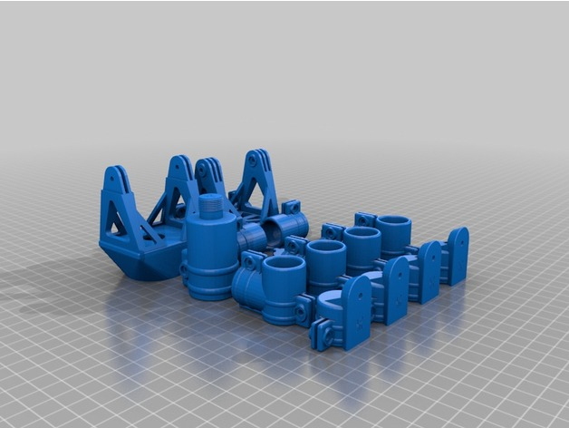
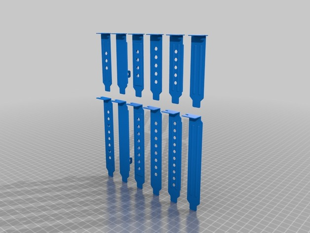
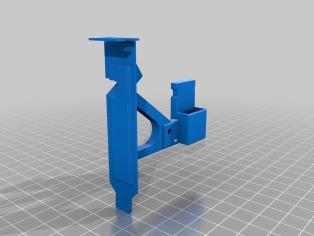
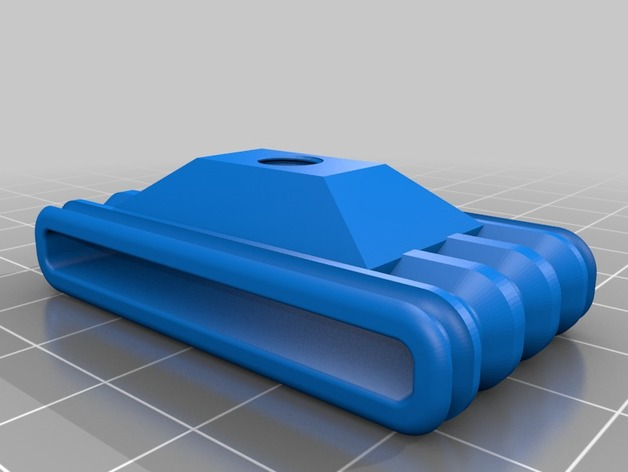

> An open-source parametric framework for mechanical design in [OpenSCAD].

Overview
--------

  [omdl], OpenSCAD Mechanical Design Library, is an open-source
  parametric framework for mechanical design in [OpenSCAD]. It provides
  reusable design primitives and fabrication-oriented modules intended
  to support real mechanical workflows rather than isolated geometric
  modeling.

  omdl was originally conceived to support the design of mechanically
  engineered objects intended for real-world CNC-based fabrication. A
  central goal of the library is to **separate design intent from
  implementation parameters**, enabling late-time parameter binding
  during model composition.

  By decoupling intent from geometry, designers can work at a higher
  level of abstraction, describing what a component must achieve rather
  than committing early to specific dimensions or configurations. This
  approach increases target outcome flexibility, allowing designs to be
  recomposed or adapted to new requirements without rewriting core
  geometry.

  In practice, this means that assemblies can be adjusted to match a
  particular application, manufacturing constraint, or the commodity
  components currently available. Late parameter binding allows the
  same design definition to integrate different off-the-shelf parts,
  making omdl well suited for iterative engineering workflows and
  fabrication-driven design.

  The library emphasizes:

  - **Parametric mechanical design:** components are defined by
    properties and intent rather than fixed geometry.

  - **Standardized data types:** Structured parameter abstractions used
    to convey configuration, intent, and implementation details between
    modules.

  - **Minimal global state:** modules are designed to be predictable and
    composable.

  - **Unit operations:** consistent handling of lengths, angles, and
    dimensional data.

  - **Integrated documentation:** API behavior and usage are documented
    directly in source using [Doxygen] and [openscad-amu].

  - **Validation-driven development:** automated scripts verify
    functionality of core primities  across evolving OpenSCAD versions.

  Instead of treating OpenSCAD purely as a shape generator, omdl
  introduces a structured mechanical design layer that helps bridge
  conceptual design, drafting, and fabrication.

Design Philosophy
-----------------

  omdl is designed for users who want to create mechanically meaningful
  models intended for CNC-based fabrication. The library emphasizes
  reusable design patterns that reflect real engineering workflows,
  including assemblies, components, fabrication tooling, and drafting
  aids. By providing structured, parametric building blocks, omdl
  enables designers to move beyond low-level geometry.

  Key goals include:

  - Provide higher-level abstractions built on standard OpenSCAD
    primitives.

  - Separate geometry construction from mechanical intent.

  - Formalizes parameter communication and late-binding of
    implementation details across modules.

  - Encourage consistent dimensional practices through explicit unit
    conversion.

  - Maintain readable source code that doubles as its own documentation.

  The library is organized into modular groups that represent distinct
  functional areas, including tooling utilities, drafting operations,
  design data, mathematical operations, geometric primitives, and
  mechanical components. This structure encourages separation of
  concerns while allowing developers to work at the appropriate level
  of abstraction for their design.

  Modules are designed to be included individually as needed, helping
  keep projects lightweight and reducing unnecessary dependencies. This
  modular approach also supports interoperability, making it easier to
  integrate omdl alongside other OpenSCAD design libraries without
  imposing a rigid project structure.

Documentation Approach
----------------------

  All documentation is generated from inline source comments using
  [Doxygen]. The documentation is retrieved from the source code and
  pre-processed by [openscad-amu] before being sent to Doxygen for
  processing into the desired output format.

  This approach ensures that:

  - examples remain synchronized with the implementation,

  - parameter behavior is clearly described,

  - documentation can be exported to multiple formats such as HTML or PDF.

  Validation scripts are executed during the documentation build
  process to confirm that core operations behave consistently across
  supported OpenSCAD versions. This has become less pressing with the
  maturing OpenSCAD language.

Who This Library Is For
-----------------------

  omdl is intended for:

  - Mechanical engineers using OpenSCAD for parametric design

  - Makers building fabrication-ready components

  - Developers creating reusable mechanical modules

  - Projects that benefit from application-specific mechanical design

  - “Just-fit” solutions using available commodity components

  It may be less suitable for purely artistic modeling workflows where
  strict dimensional control is unnecessary.

Getting started
---------------

  To get started using [omdl], please see the GitHub source
  [repository]. An online [omdl-snapshot] of the library documentation
  is available for quick reference, though it may not always reflect
  the latest updates.

Design Examples
---------------

  <table>
  <colgroup>
  <col width="25%" />
  <col width="75%" />
  </colgroup>
  <thead>
  <tr class="header">
  <th>example</th>
  <th>description</th>
  </tr>
  </thead>
  <tbody>

  <tr>
  <td>
  

  
  

  </td>
  <td>
  <a href="http://www.thingiverse.com/thing:2051608">
  A Portable solar panel tripod mount
  </a>: Designed in 48 hours from concept to assembly using omdl and openscad-amu.
  </td>
  </tr>

  <tr>
  <td>
  

  
  

  </td>
  <td>
  <a href="http://www.thingiverse.com/thing:2836187">
  PCI Bracket Generator
  </a>
  </td>
  </tr>

  <tr>
  <td>
  

  
  

  </td>
  <td>
  <a href="http://www.thingiverse.com/thing:2841089">
  PCI-E 1x Riser Card Bracket
  </a>
  </td>
  </tr>

  <tr>
  <td>
  

  
  

  </td>
  <td>
  <a href="http://www.thingiverse.com/thing:2811619">
  Webcam tripod mount
  </a>
  </td>
  </tr>

  </tbody>
  </table>

[omdl]: https://royasutton.github.io/omdl
[repository]: https://github.com/royasutton/omdl

[omdl-snapshot]: https://royasutton.github.io/omdl-snapshot

[openscad-amu]: https://royasutton.github.io/openscad-amu
[Doxygen]: http://www.doxygen.nl
[OpenSCAD]: http://www.openscad.org
